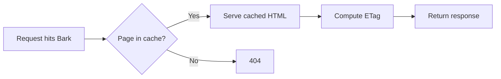
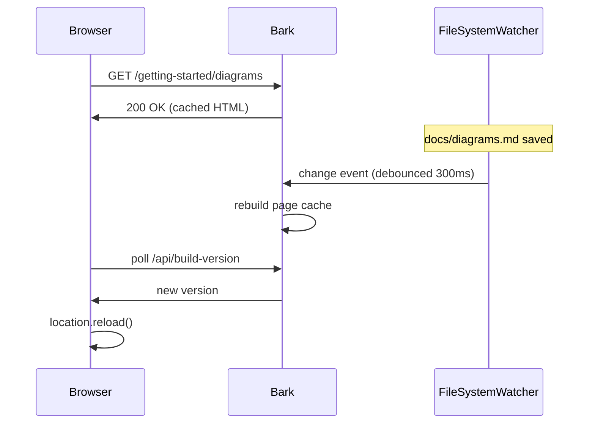
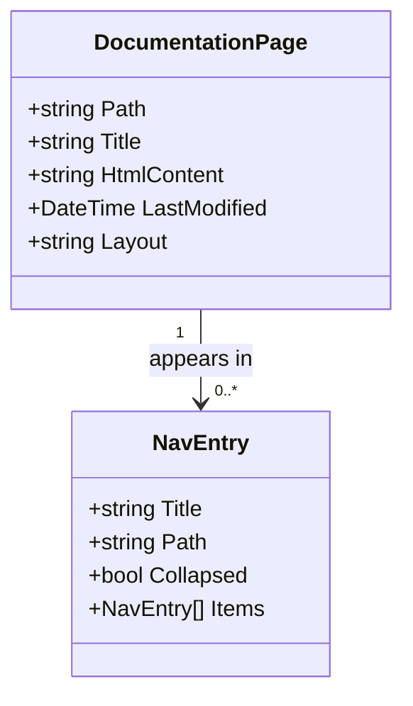
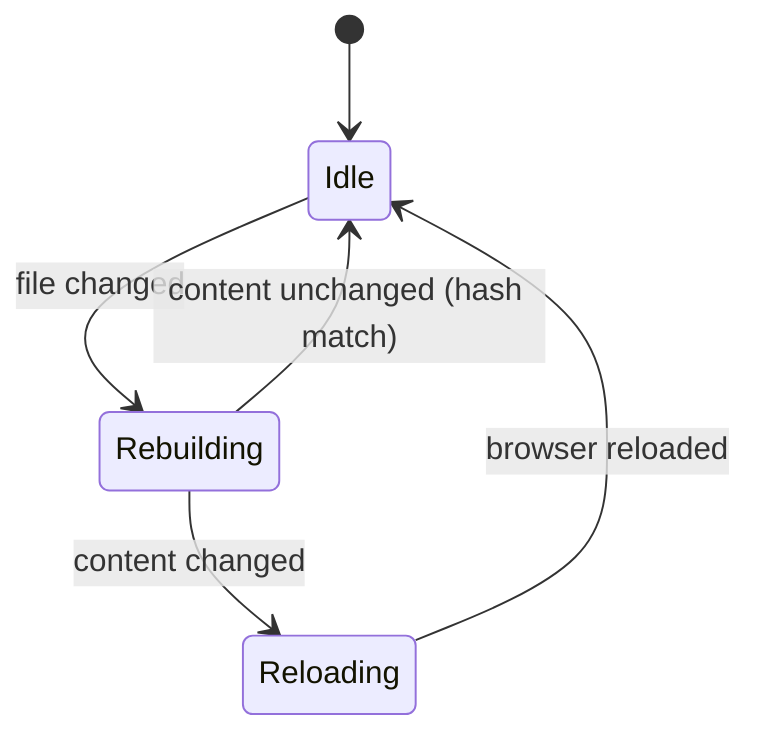
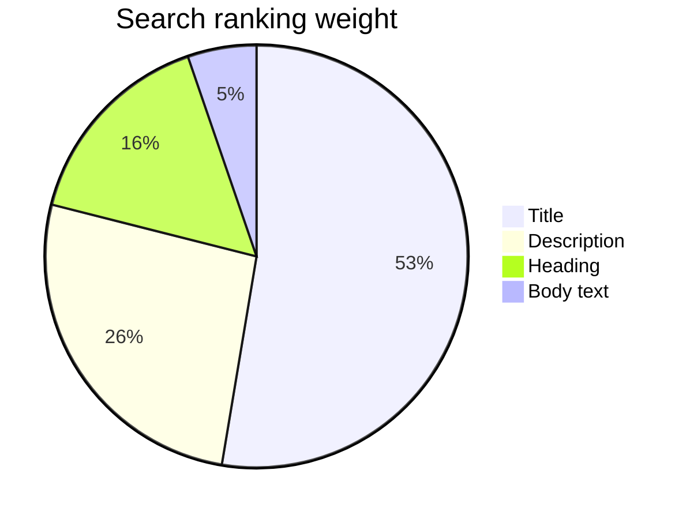

# Using Diagrams

To fence a Mermaid block, simply use the `mermaid` language identifier. Bark will automatically detect this and render it as a diagram rather than displaying it as a code listing.

This process requires no plugins or build steps. The client loads `mermaid.js` once per page and replaces the raw code block with the rendered SVG after the page has finished loading.

## Flowchart

````md

````


## Sequence diagram



## Class diagram

Useful for explaining a data model, not just code architecture:



## State diagram



## Pie chart



## What's not here

No live diagram editor, no export-to-PNG button, no Mermaid config object in `config.json`. Bark calls `mermaid.initialize({ startOnLoad: false, theme: ... })` and picks `theme` automatically from whatever light/dark mode is active, then renders on page load. If you need custom theming per diagram, that's a Mermaid frontmatter directive inside the diagram source itself (`%%{init: {...}}%%`)!

::: note
Diagrams on this site render client-side after the initial page load. Consequently, they are not visible in the raw HTML source or to automated tools that only scrape text, including many search engine crawlers and text-based indexing files like `sitemap.xml` or `llms.txt`. If a diagram is essential to the reader's understanding of the content, please ensure that the core information is also provided in the surrounding text.
:::

::: note
Mermaid bakes its colors into the rendered SVG, it doesn't follow CSS variables the way the rest of the page does. Toggling dark mode on a page with diagrams triggers a full reload so they redraw with the right theme.
:::
