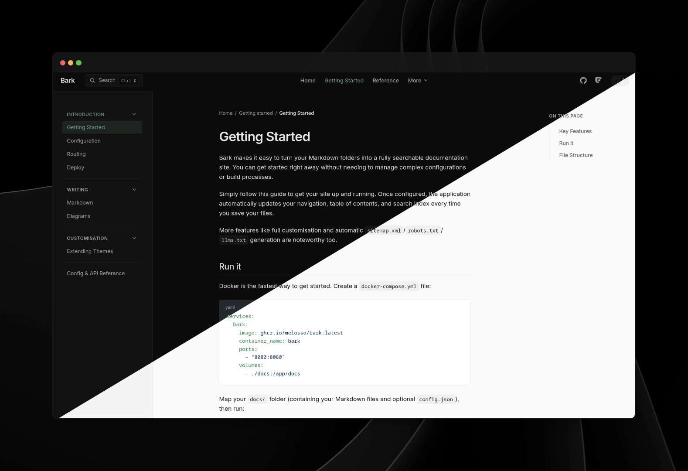

# 🌳 Bark

[](LICENSE)
[](https://github.com/melosso/bark/commits/main)
[](https://github.com/melosso/bark/pkgs/container/bark)

Meet Bark: your new favorite way to serve documentation. If you have a folder full of [Markdown](https://www.markdownguide.org/getting-started/) files, you have a beautiful, searchable documentation site ready to go.

Built on the modern .NET stack, Bark is designed for those who want a powerful, self-hosted solution without being tethered to the traditional Microsoft ecosystem.



---

## Installation

Pick whichever path fits your environment. Docker is the fastest way to get running.

### Option A: Docker Compose

Prebuilt images are published to GHCR on every tagged release. Create a `docker-compose.yml` file with the following content:

```yaml
services:
  bark:
    image: ghcr.io/melosso/bark:latest
    container_name: bark
    ports:
      - "8080:8080"
    volumes:
      - ./docs:/app/docs

```

Mount your own `docs/` folder containing your `.md` files and optional `config.json`. When that is done, run `docker compose up -d` to start the container and browse to `http://localhost:8080`.

### Option B: Windows / IIS

For those running Windows, follow the following steps:

1. Download the latest `*-Windows_x64.zip` from [Releases](https://github.com/melosso/bark/releases).
2. Extract it to your site folder (e.g. `C:\inetpub\bark`).
3. In IIS, create a site (or app) pointing at that folder, with the **No Managed Code** .NET CLR version.
4. The zip already includes a `web.config` wired for in-process hosting. No manual edits needed.
5. Make sure the [.NET 10 Hosting Bundle](https://dotnet.microsoft.com/en-us/download/dotnet/10.0) is installed on the server (gives IIS the ASP.NET Core Module).
6. Start the site and browse to it.

A Linux x64 self-contained-runtime build (`*-Linux_x64.zip`) is published alongside each release. See [Option C: Linux release zip](Bark/docs/getting-started/deploy#option-c-linux-release-zip) for installation instructions.

## Configuration

#### Writing documentation

Drop Markdown files into `docs/`. Folder structure becomes the navigation tree; `index.md` becomes a section's landing page.

```markdown
---
title: Installation
description: Get Bark running locally
---

# Installation

You can write your own documentation right here!
```

Front attributes such as `title`, `description` are entirely optional. Bark falls back to the filename.

#### Configuration

Drop a `docs/config.json` to set brand text, navigation, and social links:

```json
{
  "brand": "Bark",
  "nav": [
    {
      "title": "Getting Started",
      "items": [
        { "title": "Installation", "path": "getting-started/installation" }
      ]
    }
  ]
}
```

When `nav` is present it replaces the auto-generated folder-based navigation. Both content and config are hot-reloaded. No restart needed.

Theme overrides, such as CSS variables, dark mode and custom CSS, are handled through environment variables or `appsettings.json` instead.

## License

Licensed under the **AGPL 3.0** license. See [LICENSE](LICENSE) for details.